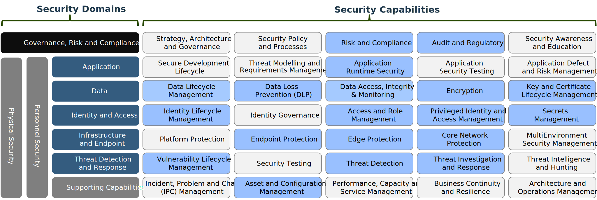

---

copyright:

  years: 2024

lastupdated: "2024-10-04"

keywords:

---

{{site.data.keyword.attribute-definition-list}}

# Security in VPC IaaS Environments
{: #white-paper}

Cloud security is a set of security measures that protect cloud-based data, applications, and infrastructure. It's a type of cybersecurity that involves both cloud providers and their clients. Cloud security protects against internal and external threats to business security and ensures that legal requirements are met.
{: shortdesc}

This document provides an overview of {{site.data.keyword.cloud_notm}}’s security capabilities, options, best practices and solutioning guidance associated with those capabilities. The scope includes Virtual Private Cloud (VPC) Infrastructure as a Services (IaaS) security capabilities. Security in other landing zones such as VMWare and OpenShift will be handled in future documents.

{{site.data.keyword.Bluemix_notm}} has a broad range of security capabilities, but other options like 3rd party solutions might be discussed that can be applicable to hybrid or multi-cloud situations. Some of the options might also include those from IBM Cybersecurity Services. These are presented in the IBM Cybersecurity Services Capabilities section.

Overview information on [general cloud security concepts](https://www.ibm.com/topics/cloud-security#:~:text=These%20principles%20are%20built%20on,security%20posture%20management%20(CSPM)){: external} is available. Another reference source is the security section within the [{{site.data.keyword.Bluemix_notm}} Architecture Center](https://mediacenter.ibm.com/channel/IBM+Cloud+Architecture+Center/182050661){: external}.

This document is geared toward cloud consultants, architects, engineers, and it assumes that the reader has a level of cloud proficiency and general knowledge of security concepts. This white paper isn't meant to be a cloud or security tutorial or technically comprehensive with the particular security solutions mentioned.

## General security best practices and solutioning guidance
{: #general-security-best-practices}

There are many different security best practices for cloud deployments, but one that is most prominent and important today is the overarching approach of the zero trust model. Zero trust has some key principles that should be considered in any security design. These principles include:

- Never trust, always verify
- Enforce least privilege access
- Enable strong authentication, and periodic and recurring authentication as possible
- Assume breaches everywhere and protect and detect accordingly.
- Segment functions and related network areas to create security perimeters to limit blast radiuses of attacks.
- Discover all possible resources, functions, components, and data that is used in an environment and ensure total visibility – you cannot secure what you cannot see.
- Use continuous security monitoring

This paper shows how various {{site.data.keyword.Bluemix_notm}} security elements can be deployed following a zero trust approach. For more information, see the [National Institute of Standards and Technology paper](https://csrc.nist.gov/pubs/sp/800/207/final){: external}. Additional sources on zero trust principles and applications are available.

### Security solutions framework
{: #Security-Solutions-Framework}

{{site.data.keyword.IBM_notm}} uses a broad standard framework in all its security endeavors. This includes design, consulting, and implementation described in the following sections for reference. Now some, but not all of these are necessarily applicable for {{site.data.keyword.Bluemix_notm}} in Virtual Private Cloud environments from a technical capability perspective. Only the boxes highlighted in blue in the diagram will be discussed. Some of these capability categories can be broken down further and these are discussed in detail starting in the following sections.

{: caption="Figure 1. IBM Security Framework" caption-side-"bottom"}

### IBM Cybersecurity Security Services capabilities: options in certain situations
{: #CSS-capabilities}

{{site.data.keyword.IBM_notm}} Cybersecurity Services is a specific business unit within {{site.data.keyword.IBM_notm}} that focuses specifically on security. They have a broad range of security solutions and associated consulting and managed services. The list below provides an overview of their solutions, and these can be considered additional options in {{site.data.keyword.Bluemix_notm}} that may be applicable in certain scenarios like hybrid or Multicloud situations.

 - Infrastructure and endpoint security: various 3rd Party Firewalls, for example, Palo Alto and Cisco and so on.
 - [QRadar Security Event and Information Management (SIEM), Network Detection and Response (NDR)](https://www.ibm.com/docs/en/qsip/7.5?topic=qradar-network-detection-response){: external}
 - Endpoint Protection and Detection & Response (EPP/EDR) solutions [Qradar with ReaqTa](https://www.ibm.com/products/qradar-edr){: external}
 - Unified Endpoint Management (UEM): [MaaS360](https://www.ibm.com/products/maas360/unified-endpoint-management){: external}
 - Data security: [Guardium](https://www.ibm.com/guardium){: external} data security suite, for example, data classification, data loss prevention, and so on, [Cloud Pak for Data](https://www.ibm.com/products/cloud-pak-for-data){: external} [Guardium key lifecycle manager](https://www.ibm.com/products/ibm-security-key-lifecycle-manager){: external}
 - Privilege access management: [Verify Security Access Manager](https://www.ibm.com/verify?utm_content=SRCWW&p1=Search&p4=43700074603995210&p5=e&p9=58700008209808680&gbraid=0AAAAAD-_QsSZDEGKcMolwjQsuv8eqwjLo&gclid=Cj0KCQjwv7O0BhDwARIsAC0sjWOaQuEP0I2kLEyJl9wJ5UCNnM7uk8aP8K7aGQsntGk-6rP4o2ixZJ8aAnBzEALw_wcB&gclsrc=aw.ds){: external}
 - Container security - 3rd parties: Palo Alto Prisma Cloud and Illumio.

## Security Domains
{: #security-domains}

### Data security
{: #data-security}

Data security is the process of protecting digital information throughout its life cycle from unauthorized access, corruption, theft, or destruction. The following sections discusses {{site.data.keyword.Bluemix_notm}}'s capabilities in this domain.

The following concepts are discussed:
 - [Data-at-rest encryption](/docs/pattern-vpc-security?topic=pattern-vpc-security-white-paper#data-at-rest-encryption)
 - [Key management and lifecycle management](/docs/pattern-vpc-security?topic=pattern-vpc-security-white-paper#key-management)
 - [Data-in-transit encryption](/docs/pattern-vpc-security?topic=pattern-vpc-security-white-paper#Data-in-Transit-Encryption)
 - [Certificate lifecycle management](/docs/pattern-vpc-security?topic=pattern-vpc-security-white-paper#certificate-management)
 - [Data lifecycle management and governance](/docs/pattern-vpc-security?topic=pattern-vpc-security-white-paper#data-lifecycle-management)
 - [Data Loss Prevention (DLP) and data access, integrity and monitoring](/docs/pattern-vpc-security?topic=pattern-vpc-security-white-paper#DLP)

#### Data-at-rest encryption
{: #data-at-rest-encryption}

{{site.data.keyword.Bluemix_notm}} provides native, integrated data-at-rest encryption for VPC volumes and snapshots and file storage/VPC shares automatically. {{site.data.keyword.Bluemix_notm}} also provides data-at-rest encryption for its object storage by default. All the encryption used adheres to the AES-256 standard. Customers can use IBM-managed encryption (default) or customer-managed keys.

The following **options** are available for data-at-rest encryption:

 - {{site.data.keyword.Bluemix_notm}} default encryption: This is automatic if another key management scheme isn't selected. IBM keys are used.
 - {{site.data.keyword.Bluemix_notm}} encryption with customer keys: The customer selects an {{site.data.keyword.Bluemix_notm}} native key management system (KMS). {{site.data.keyword.Bluemix_notm}} has two KMSs: {{site.data.keyword.keymanagementservicelong_notm}} and {{site.data.keyword.hsplatform}}.
 - External encryption solution: A customer might be using their own data encryption solution on-premises and want to extend this to the cloud. Or, a customer might want centralized data control across multiple clouds. {{site.data.keyword.IBM_notm}} IBM Cybersecurity Services has an applicable solution known as [Guardium](https://www.ibm.com/guardium){: external}.

The following are **best practices** for data-at-rest encryption:

 - Data encryption should always be used as can be expected.
 - Cloud native encryption with a designated cloud native KMS provides the best lifecycle automation and orchestration.
 - Encrypting data with customer managed keys is recommended to meet regulatory compliance for additional security and customer control.

The following is **solutioning guidance** for data-at-rest encryption:

 - [Securing Your Data in VPC](/docs/vpc?topic=vpc-mng-data&interface=ui)
 - [About data encryption for VPC](/docs/vpc?topic=vpc-vpc-encryption-about)
 - [Encrypting Your Data](/docs/cloud-object-storage?topic=cloud-object-storage-encryption)
 - [Encrypting Your Data](/docs/cloud-object-storage?topic=cloud-object-storage-encryption).

#### Key management and lifecycle management
{: #key-management}

Key management allows cloud customers the ability to create, store, manage and rotate keys with automation to support storage encryption. {{site.data.keyword.Bluemix_notm}} has two native, integrated key management services, {{site.data.keyword.keymanagementservicelong_notm}} and Hyper Protect Crypto Services. For more information see:

 - [{{site.data.keyword.keymanagementservicefull}}](/docs/key-protect?topic=key-protect-about)
 - [Getting started with Hyper Protect Crypto Services](/docs/hs-crypto?topic=hs-crypto-get-started)
 - [Introducing Unified Key Orchestrator](/docs/hs-crypto?topic=hs-crypto-introduce-uko).

 The following diagram is a depiction of the two types of key management capabilities in IBM Cloud.

{: caption="Figure 1. Key Management Capabilities" caption-side="bottom"}

The following **options** are available for key management:

 - {{site.data.keyword.keymanagementservicelong_notm}} - Applicable in situations where key storage security requirements are not highly critical and where a multi-tenant solution is sufficient. This capability is commonly referred to as Bring Your Own Key (BYOK) and it is certified to meet the Federal Information Processing Standard (FIPS)-140-2 level 3, hardware security module (HSM) requirements.
 - Hyper Protect Crypto Service (HPCS): {{site.data.keyword.hsplatform}} provides key management services with the highest level of security and control offered by any cloud provider in the industry. It uses a dedicated (single-tenant) FIPS 140-2 Level 4 certified Hardware Security Module and supports customer-managed master keys, giving the customer exclusive control of the entire key hierarchy. {{site.data.keyword.hsplatform}} is specifically recommended for financial service environment.
 - {{site.data.keyword.Bluemix_notm}} native {{site.data.keyword.hsplatform}} with Unified Key Orchestrator - This particular variant of the {{site.data.keyword.hsplatform}} key management solution noted directly above add the ability to manage key across various clouds in addition to {{site.data.keyword.Bluemix_notm}}.
 - Customer or 3rd party key management solution: This might be applicable when a customer is using an external or 3rd party solution in a hybrid or multi-cloud environment.

The following are **best practices** for key management:

 - Cloud native key management offers the most secure, integrated and automated key lifecycle management.
 - User access to keys should be tightly controlled and monitored as can be expected.
 - Processes should be established on how keys should be used and managed. Proper rotation of keys should be established.
 - Regular inspection of activity logs surrounding key management should occur.

The following is **solution guidance** for key management:
 - [Provisioning {{site.data.keyword.keymanagementservicelong_notm}}](/docs/key-protect?topic=key-protect-provision)
 - [Getting Started with {{site.data.keyword.Bluemix_notm}} Hyper Protect Crypto Service](/docs/hs-crypto?topic=hs-crypto-get-started).

#### Data-in-transit encryption
{: #Data-in-Transit-Encryption}

Data-in-transit encryption can occur in multiple areas within the {{site.data.keyword.Bluemix_notm}}. There can be external applications using HTTPS/SSL that would terminate to servers within a VPC or load balancers and NexGen firewalls in front of the servers in VPCs. There is also default data-in-transit encryption when there are accesses and traffic transits to Object, Block and File Storage and cloud services.

The following **options** are available for data-in-transit encryption:

 - Data-in-Transit encryption to {{site.data.keyword.Bluemix_notm}} storage - No options. This is a default function.
 - Application Level Data-in-Transition Encryption - Applicable mostly in public access situations but of course this can be applied in private access situations. Transit Level Security (TLS) 1.2 should be used at a minimum.
 - Application-level data-in-transit encryption termination - TLS termination at a NexGen firewall TLS termination at an edge load balancer TLS termination with {{site.data.keyword.Bluemix_notm}} {{site.data.keyword.cis_short_notm}}.

The following are **Best practices** for data-in-transit encryption:

Application-level data-in-transition encryption should always be applied in public access situations. Application-level data-in-transit encryption should always be terminated at the edge at a firewall or a load balancer. When the traffic is decrypted at the edge, it can be inspected for threats, and so on. Application-level encryption termination should not occur on servers that are in the interior of a network.

The following includes **solution guidance** for data-in-transit encryption:

 - [Encryption in transit - Securing mount connections between file share and virtual server instance](/docs/vpc?topic=vpc-file-storage-vpc-eit)
 - [Encryption in transit - Securing mount connections between file share and virtual server instance](/docs/vpc?topic=vpc-file-storage-vpc-eit)
 - [SSL offload with {{site.data.keyword.Bluemix_notm}} Load Balancer](/docs/loadbalancer-service?topic=loadbalancer-service-ssl-offload-with-ibm-cloud-load-balancer)
 - [Managing origin certificates](/docs/cis?topic=cis-cis-origin-certificates)
 - [Setting Transport Layer Security (TLS) options](/docs/cis?topic=cis-cis-tls-options)
 - [Getting started with {{site.data.keyword.secrets-manager_full_notm}}](/docs/secrets-manager?topic=secrets-manager-getting-started&interface=ui) ({{site.data.keyword.secrets-manager_full_notm}} will be discussed further in the document, but it can store certificates that can be used in data-in-transit encryption.) Also see the following immediate section relating to certificates.

#### Certificate lifecycle management
{: #certificate-management}

Certificates can be used in several areas within {{site.data.keyword.Bluemix_notm}} to provide data-in-transit TLS encryption in such areas as load balancers, API gateways, and so on. {{site.data.keyword.Bluemix_notm}} has certificate management capabilities which allow customers to provision, manage, and deploy public and private SSL/TLS certificates for use with {{site.data.keyword.Bluemix_notm}} services and applications. For more information see: [Getting started with {{site.data.keyword.secrets-manager_full_notm}}](/docs/secrets-manager?topic=secrets-manager-getting-started)

The following **options** are available for certificate management:

 - {{site.data.keyword.secrets-manager_full_notm}} - Highly recommended when {{site.data.keyword.Bluemix_notm}} is primarily used
 - No Certificate Management - Perhaps applicable in private environments with Dev/QA workloads and or where there is a minimal number of certificates to managed.
 - Customer-Owned or 3rd Party Certificate Management Solutions.

The following are **Best Practices** for certificate management:

 - Regular rotations of certificates
 - Notification of expiring certificates
 - Certificate storage in a hardware security module
 - Maintain certificate inventory
 - Document certificate management procedures.

The following is **solution guidance** for certificate management:

 - [Importing SSL/TLS certificates](/docs/secrets-manager?topic=secrets-manager-certificates&interface=ui)
 - [Ordering SSL/TLS public certificates](/docs/secrets-manager?topic=secrets-manager-public-certificates&interface=ui)
 - [Creating SSL/TLS private certificates](/docs/secrets-manager?topic=secrets-manager-private-certificates&interface=ui).

#### Data lifecycle management and governance
{: #data-lifecycle-management}

{{site.data.keyword.Bluemix_notm}} provides a range of data security measures as discussed, but customers may want full data lifecycle management and security across data in hybrid or multi-cloud environments. These capabilities may include data discovery, data classification, data tagging, data integrity checks and loss prevention among others. There are several 3rd party solutions in the market in this full data lifecycle management realm. One such solution from IBM Cyber Security Services is known [Guardium](https://www.ibm.com/guardium){: external}.

#### Data Loss Prevention (DLP) and data access, integrity and monitoring
{: #DLP}

{{site.data.keyword.Bluemix_notm}} has a number of ways to control data access such as identity and access management (IAM) and permissions on object storage and so on. And there is {{site.data.keyword.cloudaccesstraillong_notm}} which logs all user and API access to data. But there are no specific ways to specifically monitor and control data loss and data integrity. This is typically the realm of 3rd party data control solutions. For more information, see [What Is Data Loss Prevention (DLP)](https://www.ibm.com/topics/data-loss-prevention){: external}.

### Identity and Access Security
{: #identity-and-access}

Cloud Identity and Access Management (IAM) is a set of tools, policies, and practices that control user access to cloud resources like data, applications, and services. The following sections discusses {{site.data.keyword.Bluemix_notm}}'s capabilities in this domain.

The following concepts are discussed:
 - [Access and Role Access Management](/docs/pattern-vpc-security?topic=pattern-vpc-security-identity-and-access#aram)
 - [IAM with Single Sign-On (SSO) and Identity Provider (IdP) federation](/docs/pattern-vpc-security?topic=pattern-vpc-security-identity-and-access#IAMSSO)
 - [Secrets management](/docs/pattern-vpc-security?topic=pattern-vpc-security-identity-and-access#secrets-management)
 - [Bastion host and Privilege Access Management (PAM)](/docs/pattern-vpc-security?topic=pattern-vpc-security-identity-and-access#bastion-host)
 - [Identity governance](/docs/pattern-vpc-security?topic=pattern-vpc-security-identity-and-access#IAMgovernance)

#### Access and Role Access Management
{: #aram}

{{site.data.keyword.Bluemix_notm}} has a full featured native IAM that can control all aspects of admin user actions and services within an account. It enables you to securely authenticate users for platform services and control access to resources consistently across {{site.data.keyword.Bluemix_notm}}. For more information, see [Access management in {{site.data.keyword.Bluemix_notm}}](/docs/account?topic=account-cloudaccess) and [How {{site.data.keyword.Bluemix_notm}} IAM works](/docs/account?topic=account-iamoverview&interface=ui).
The following highlights some of the major IAM functions available.

| IAM Capability                                                                                                 | Function or Feature                                                                                                                                                                                                                                                                                                                                                                                                                                                                                                                                                                                                                                                                                                                                                                                                                                                                                                                                                                                                                                                                                                                   |
|--------------------------------------------------------------------------------------------------------------------|------------------------------------------------------------------------------------------------------------------------------------------------------------------------------------------------------------------------------------------------------------------------------------------------------------------------------------------------------------------------------------------------------------------------------------------------------------------------------------------------------------------------------------------------------------------------------------------------------------------------------------------------------------------------------------------------------------------------------------------------------------------------------------------------------------------------------------------------------------------------------------------------------------------------------------------------------------------------------------------------------------------------------------------------------------------------------------------------------------------------------------------|
| [Resource groups](/docs/account?topic=account-rgs&interface=ui)                               | A resource group is a way for you to organize your account resources in customizable groupings. Any account resource that is managed by using {{site.data.keyword.Bluemix_notm}}® Identity and Access Management (IAM) access control belongs to a resource group within your account. You assign resources to a resource group when you create them from the catalog.                                                                                                                                                                                                                                                                                                                                                                                                                                                                                                                                                                                                                                                                                                                 |
| [Access groups](/docs/account?topic=account-groups&interface=ui)                              | An access group can be created to organize a set of users, service IDs, and trusted profiles into a single entity that makes it easy for you to assign access. You can assign a single policy to the group instead of assigning the same access multiple times for an individual user or service ID.                                                                                                                                                                                                                                                                                                                                                                                                                                                                                                                                                                                                                                                                                                                                                                                                                                     |
| [Service IDs](/docs/account?topic=account-serviceids&interface=ui)                            | A service ID identifies a service or application like how a user ID identifies a user. You can create a service ID and use it to enable an application outside of {{site.data.keyword.Bluemix_notm}} access to your {{site.data.keyword.Bluemix_notm}} services. You can assign specific access policies to the service ID that restrict permissions for using specific services, or even combine permissions for accessing different services.                                                                                                                                                                                                                                                                                                                                                                                                                                                                                                                                                                                                                                                                                                                                            |
| [Access policies](/docs/account?topic=account-iamusermanpol)                                  | A policy grants a subject one or multiple roles to a set of resources so that specific actions can be taken within the context of the specified target resources.                                                                                                                                                                                                                                                                                                                                                                                                                                                                                                                                                                                                                                                                                                                                                                                                                                                                                                                                                                        |
| [Roles](/docs/account?topic=account-userroles)                                                | Roles provide a certain level of access and there can be platform and service roles. Roles might have such roles as “Editor” and “Administrator”. Further roles define a set of actions that can be performed on cloud resources. Platform roles control the ability to call platform APIs to do actions such as provisioning a service instance. Service roles are supported by some services and control the ability to call service APIs. {{site.data.keyword.Bluemix_notm}} supports predefined roles such as "Administrator" and "Editor" that apply across multiple services. Services can also define custom roles that apply only to that service, and users can define their own custom roles that include only the specific actions they want to grant access to. User-defined custom roles are useful for meeting least privilege requirements."                                                                                                                                                                                                                                                                                                      |
| [Context restrictions](/docs/account?topic=account-context-restrictions-whatis)               | Context-based restrictions give account owners and administrators the ability to define and enforce access restrictions for {{site.data.keyword.Bluemix_notm}}® resources based on a rule's criteria. The criteria include the network location of access requests, the endpoint type from where the request is sent, and sometimes the API that the request tries to access. These restrictions work with traditional IAM policies, which are based on identity, to provide an extra layer of protection.                                                                                                                                                                                                                                                                                                                                                                                                                                                                                                                                                                                                                                                        |
| [Multi-Factor Authentication (MFA)](/docs/account?topic=account-types&interface=ui)                 | Multifactor authentication (MFA) adds an extra layer of security to your account by requiring all or specific or designated users to authenticate by using another authentication factor beyond an ID and password. MFA is also commonly known as two-factor authentication (2FA). When MFA is enabled, a user is prompted to provide a unique identifier (such as a username or email) and a one-time password (OTP) generated by an authenticator app or a hardware token. This type of MFA is much more secure than account-based MFA because it is not limited to classic infrastructure resources and applies to all resources within the account. It also reduces the risk of a breach because of a weak password or the use of the same password across multiple accounts.                                                                                                                                                                                                                                                                                                                                                      |
| [Trusted profiles](/docs/account?topic=account-trustedprofile-fedusers-tutorial&interface=ui) | By using trusted profiles, you can establish a flexible, secure way for federated users to access the {{site.data.keyword.Bluemix_notm}}® resources they need to do their job. All federated users that share certain attribute that are defined in your corporate user directory are mapped to a common profile and can share access to {{site.data.keyword.Bluemix_notm}} resources. This common identity makes it possible to give the members of your organization that share access requirements automatic access to resources one time, rather than having to add each user to an account and then grant them access directly or by using access groups. Trusted profiles can also be used to grant access to service IDs, compute resources, or services. Allowing a compute resource to assume that a trusted profile allows you to assign access to applications running on that resource without the need for a long-term credential that then must be managed and rotated. This greatly enhances the security of applications running in {{site.data.keyword.Bluemix_notm}}. For more information, see [Using a trusted profile to call IAM-enabled services](/docs/vpc?topic=vpc-imd-trusted-profile-metadata) |
{: caption="Table 1: {{site.data.keyword.Bluemix_notm}} Identity and Access Management Capabilities" caption-side="bottom"}

The following diagram provides insight on how IAM works in the {{site.data.keyword.Bluemix_notm}}.

{: caption="Figure 1. Identity and access management depiction" caption-side="bottom"}

Access and role access management **options** include:

 - Multi-Factor Authentication (MFA) and complex passwords: Using MFA and complex passwords are always recommended.
 - Assigning individual-based accesses and policies: This option is not recommended. Users should be placed into access groups or in trusted profiles with specific policies.
 - Single Sign On (SSO) Federation: Applicable where customers already have a single sign-on infrastructure or where customers want to use their established Active Directory or LDAP, and so on.

Access and role access management **best practices** include:

 - Review [Best Practices for Organizing Resources and Assigning Access](/docs/account?topic=account-account_setup).
 - Always apply a least privilege approach for all cloud access.
 - Never use a root account for any administration. Always apply context restrictions for IAM access.
 - Never apply IAM capabilities to a single user.
 - Use trusted profiles or access groups and assign policies to the access group.
 - Always use multi-factor authentication and a complex password and rotation policy.
 - Develop thorough documentation that dictates how IAM is used in your {{site.data.keyword.Bluemix_notm}} accounts
 - Conduct regular, periodic reviews of your account IAM settings in relation to your IAM documentation and policies. Over time, settings can drift or be inadvertently changes resulting in overly permissible states.
 - Conduct periodic reviews of IAM logs provided by [{{site.data.keyword.cloudaccesstraillong}}](/docs/activity-tracker?topic=activity-tracker-about) to look for access anomalies.

Access and role access management **solution guidance** include:

Customers are encouraged to review the documentation in the [Managing Your Account, Resources, Access](/docs/account) documentation for more insight on best IAM practices and solutioning guidance.

- [Access management in {{site.data.keyword.Bluemix_notm}}](/docs/account?topic=account-cloudaccess)
- [How {{site.data.keyword.Bluemix_notm}} IAM works](/docs/account?topic=account-iamoverview)
- [Best Practices for Organizing Resources and Assigning Access](/docs/account?topic=account-account_setup)
- Use trusted profiles to assign access to compute resources rather than embedding credentials in applications.

#### IAM with Single Sign-On (SSO) and Identity Provider (IdP) federation
{: #IAMSSO}

{{site.data.keyword.Bluemix_notm}} IAM allows federation so that you can integrate with your external identity provider (IdP) to securely authenticate external users to your {{site.data.keyword.Bluemix_notm}} account. By using your IdP, you can provide a way for users in your company to use single sign-on (SSO). For more information, see [Single Sign On](/docs/appid?topic=appid-cd-sso).

The following **Options** are available for single sign-on.

 - SSO: Applicable where federation with other identity providers or external directories is required.
 - No SSO: Customers may forgo SSO if they have no federation with Identity Providers.

The following are **best practices** for single sign-on.

 - Use {{site.data.keyword.Bluemix_notm}} Trusted Profiles along with any SSO solution
 - Ensure multi-factor authentication with the SSO solution
 - Enforce granular role and permission management.

The following is **solution guidance** for single sign-on.

 - [Which is the right federation option for you?](/docs/account?topic=account-federation-option-for-you)
 - {{site.data.keyword.Bluemix_notm}} SAML Federation Guide [Enabling authentication from an external identity provider.](/docs/account?topic=account-idp-integration)
 - [Managing access for federated users by using trusted profiles](/docs/account?topic=account-trustedprofile-fedusers-tutorial&interface=ui).

#### Secrets management
{: #secrets-management}

Secrets management is a way to securely store and manage API keys, certificates, user ID and password credentials, and other sensitive information with automation and integration. {{site.data.keyword.Bluemix_notm}}’s service is known as {{site.data.keyword.secrets-manager_full_notm}} and it has several key security features such as secrets lifecycle management, logging, default encryption, IAM integration, versioning. For more information, see [Getting started with {{site.data.keyword.secrets-manager_full_notm}}](/docs/secrets-manager?topic=secrets-manager-getting-started).

The following **options** are available for secrets management:

 - {{site.data.keyword.Bluemix_notm}} {{site.data.keyword.secrets-manager_full_notm}}: Automated and native secrets management solution that is fully integrated with IBM.
 - No secrets management: Never recommended again, but this might be applicable where you have a private environment that is used for noncritical dev and test and the like. Secrets here might possibly be embedded into applications here, if security requirements are low and cost is a factor.
 - 3rd party secrets management solution: This option might be applicable in multi-cloud situation but secrets management automation with {{site.data.keyword.Bluemix_notm}} is lost.

The following are **best practices:** for secrets management:

 - {{site.data.keyword.Bluemix_notm}} is focused on enterprise workloads and these workloads should always include secrets management.
 - Cloud native secrets management that provides full lifestyle capabilities and full cloud integration
 - Automated creation, rotation, revocation, and expiration of static secrets
 - Never transmit secrets via plain text. All should transit that uses TLS encryption.

The following is **solutioning guidance** for secrets management:

 - [Managing IAM access for {{site.data.keyword.secrets-manager_full_notm}}](/docs/secrets-manager?topic=secrets-manager-iam&interface=ui)
 - [Using service endpoints to privately connect to {{site.data.keyword.secrets-manager_full_notm}}](/docs/secrets-manager?topic=secrets-manager-service-connection&interface=ui)
 - [Securing your data in {{site.data.keyword.secrets-manager_full_notm}}](/docs/secrets-manager?topic=secrets-manager-mng-data&interface=ui)
 - [Protecting {{site.data.keyword.secrets-manager_full_notm}} resources with context-based restrictions](/docs/secrets-manager?topic=secrets-manager-access-control-cbr&interface=ui)
 - {{site.data.keyword.secrets-manager_full_notm}} instances are provisioned per region to spread out workloads and limit the blast radius if a regional outage occurs. {{site.data.keyword.secrets-manager_full_notm}} is a single-tenant service. CPU and memory limits are applied per {{site.data.keyword.secrets-manager_full_notm}} instance. Those limits restrict the API request rates based on the usage pattern. As a rule of thumb, it is recommended to keep the rate lower than 20 req/s. Additionally, limit the number of unique clients that make requests to a single {{site.data.keyword.secrets-manager_full_notm}} instance.
 - Another best practice is the use of one of {{site.data.keyword.Bluemix_notm}}’s key management systems {{site.data.keyword keymanagementservicelong_notm}} or Hyper Protect Crypto Services {{site.data.keyword.hsplatform}} to encrypt secrets. For more information, see [Organizing Your Secrets.](/docs/secrets-manager?topic=secrets-manager-secret-groups&interface=ui).

{{site.data.keyword.secrets-manager_full_notm}} is a high available platform which has built-in resiliency and backups in each region. Customers have specific responsibilities around secrets management. For more information, see [Security Design](/docs/vpc-resiliency?topic=vpc-resiliency-security-design). Ensure high availability of secrets management platform. Provisions for high availability and encrypted backups should be used.

#### Bastion host and Privilege Access Management (PAM)
{: #bastion-host}

A bastion host is a server used to manage access to an internal or private network from an external network - sometimes called a jump box or jump server. Because bastion hosts often sit in the Internet edge, they typically run a minimum number of services to reduce their attack surface. They are also commonly used to proxy and log communications, such as SSH sessions. Privilege Access Management (PAM) software can be loaded on top of the bastion host to provide more security functions, granular access control and logging beyond terminal SSH access.

Bastion host and PAM **options** include:

 - Virtual Server Instance (VSI) for bastion host: There are no options for an underlying platform for a Bastion Host. Bastion Hosts must be created on a virtual server instances (VSI) within the confines of a Virtual Private Cloud (VPC).
 - Bastion host, no PAM Software: Not recommended in that highly granular access, approval workflows and detailed logging may be needed.
 - Bastion with PAM software - Various 3rd party solutions are in the marketplace, and this is always recommended.

 IBM Cybersecurity Services does have a PAM solution that's known as Verify. For more information, see [IBM Cybersecurity Services Verify](https://www.ibm.com/verify?utm_content=SRCWW&p1=Search&p4=43700074603995210&p5=e&gad_source=1&gclid=Cj0KCQjwwMqvBhCtARIsAIXsZpa48PUASWhrDD-SGr-h-wY_b1IyThYC4DzKpHucYM_JWNdkzpHcjoYaAkZ_EALw_wcB&gclsrc=aw.ds){: external}
 {: note}.

Bastion host and PAM **best practices** include:

 - Bastion hosts should always be accompanied with PAM software. A least privilege approach should always be applied to permissions on the bastion host and the PAM software.
 - Detailed logs should be enabled, and regular reviews of logs should be undertaken to look for anomalies.
 - Logs from the bastion host and the PAM software should be correlated with other logs to get inferences of threats. Typically, this correlation comes in the form of a Security Event and Information Management (SIEM) Platform.

Bastion host and PAM **solution guidance** include:

 - Securely access remote instances with a bastion host. For more information, see [Access to bastion host](/docs/solution-tutorials?topic=solution-tutorials-vpc-secure-management-bastion-server).

#### Identity governance
{: #IAMgovernance}

 Identity governance is a policy or programmatic approach to identity management. All of {{site.data.keyword.Bluemix_notm}} IAM capbilities support overall identity governance. But on top of these are typically governance processes and procedures and many of these might be manual processes through documentation or automation. These would be generally be out of scope for cloud, for example, existing approval workflow systems, and so on.

### Application Security
{: #Appsec}

Application security generally is the process of developing, adding, and testing security features to applications to prevent security vulnerabilities. The following sections discusses {{site.data.keyword.Bluemix_notm}}'s capabilities in this domain.

The following concepts are discussed:
 - [Web Application Firewalling (WAF)](/docs/pattern-vpc-security?topic=pattern-vpc-security-Appsec#WAF)
 - [Distributed Denial of Service (DDoS)](/docs/pattern-vpc-security?topic=pattern-vpc-security-Appsec#DDoS)

#### Web Application Firewalling (WAF)
{: #WAF}

Web Application Firewalls (WAF) help protect web applications by performing edge filtering and monitoring HTTP traffic between a web application and the Internet. WAF is an OSI protocol Layer-7 defense in the OSI model, and it is not designed to defend against all types of attacks. {{site.data.keyword.Bluemix_notm}} has two ways to provide web application firewalling at the Internet edge. One that is typically used in a Content Delivery Network (CDN) and which is named {{site.data.keyword.cis_short_notm}}. The other WAF option is using NexGen firewalls that can be placed on the “edge” or in front of Transit VPCs. You can find information on your NexGen firewalls WAF capabilities in their respective product documentation.

The following **options** are available for web application firewalls:

- {{site.data.keyword.cis_full_notm}}: Using Cloud Internet Service WAFs may be more applicable in situations where you need a broad range of capabilities that are commonly found in Content Delivery Networks such as global load balancing, DNS features, URL control and so on
- NexGen Firewall: Applicable where a NexGen firewall is already at the Internet edge and there are no additional needs that can be found in content delivery networks. NexGen firewalls are typically deployed in “edge” or transit VPCs to provide more advanced firewall functions like Intrusion Detection and Intrusion Protect (IDS/IPS) among other capabilities.
- {{site.data.keyword.cis_full_notm}}: Using Cloud Internet Service (CIS) WAFs may be more applicable in situations where you need a broad range of capabilities that are commonly found in Content Delivery Networks such as global load balancing, DNS features, URL control and so on.
- NexGen Firewall: Applicable where a NexGen firewall is already at the Internet edge and there are no additional needs that can be found in content delivery networks. NexGen firewalls are typically deployed in “edge” or transit VPCs to provide more advanced firewall functions like Intrusion Detection and Intrusion Protect (IDS/IPS) among other capabilities.
- No WAF: Customer might elect to forgo the use of a WAF in private environments where there might be a private connection to on-premises infrastructure. A customer might have their own WAF in a Demilitarized Zone (DMZ) on-premises.

Review the following **best practices** for web application firewalls:

 - WAF should always be used in public access environments. There are many options and configurations with WAF that relate to HTTP/HTTPS, domains, and detection policies. Customers should thoroughly review these items and adapt to their own specific security needs and associated security policies.
 - As with other security protection and detections capabilities, WAF logs should be stored and inspected regularly for signs of anomalies.
 - As with other security protection and detections capabilities, logs should be stored and inspected regularly for signs of anomalies.
 - WAF logs should generally be correlated with other logs, perhaps through a Security Event and Information Management (SIEM) platform, if available.

The following is **solutioning guidance** for web application firewalls:

 - [Best practices for {{site.data.keyword.cis_short_notm}}](/docs/cis?topic=cis-best-practices-for-cis-setup)
 - [Bring Your Own (BYO) firewalls in {{site.data.keyword.Bluemix_notm}}.](/docs/gateway-appliance?topic=gateway-appliance-order-byoa)
 - [Deploying Fortigate firewall on IBM VPC Cloud.](/docs/fortigate-10g?topic=fortigate-10g-getting-started)
 - [Deploying Fortigate firewall on IBM VPC Cloud.](/docs/fortigate-10g?topic=fortigate-10g-getting-started)

#### Distributed Denial of Service (DDoS)
{: #DDoS}

A distributed denial of service (DDoS) attack is a malicious attempt to disrupt normal traffic of a server, service, or network by overwhelming the target or its surrounding infrastructure with a flood of internet traffic. These attacks can occur at the application layer and the network layer. {{site.data.keyword.Bluemix_notm}} has two ways of providing DDoS protection for designs that have public internet access. One is using {{site.data.keyword.cis_short_notm}}, and the other is using NexGen firewalls, that can be deployed on Virtual Server Instances at the Internet edge. Review the following links for more information:
- [Dealing with Distributed Denial of Service attacks](/docs/cis?topic=cis-distributed-denial-of-service-ddos-attack-concepts)
- [About {{site.data.keyword.Bluemix_notm}} Internet Services](/docs/cis?topic=cis-about-ibm-cloud-internet-services-cis)
- Information on NexGen firewalls DDoS capabilities can be found in their respective product documentation.

DDoS **options** include:

 - {{site.data.keyword.cis_short_notm}}: Applicable in public internet access environments, particularly in production environments and where dispersed users are accessing apps in a content delivery manner.
 - NexGen Firewall: More applicable where an edge firewall is already being used to and users are not dispersed, and cost is a factor.
 - {{site.data.keyword.cis_short_notm}}: Applicable in public internet access environments, particularly in production environments and where dispersed users are accessing apps in a content delivery manner.
 - NexGen Firewall: More applicable where an edge firewall is already being used to and users are not dispersed, and cost is a factor.
 - No DDoS: Not required in private only networks.

DDoS **best practices** include:

 - [Best practices for {{site.data.keyword.cis_short_notm}}](/docs/cis?topic=cis-best-practices-for-cis-setup)
 - Create a DDoS attack threat model that is a structured approach to identifying and analyzing potential risks to your online service or website from a DDoS attack.
 - Implement rate limiting by controlling the amount of traffic that is sent to a network or server.
 - Ensure log monitoring and analysis of web traffic to look for anomalies such as unusual high traffic volume or server errors.

DDoS **solution guidance** includes:

 - [FAQs for {{site.data.keyword.Bluemix_notm}} Internet Services](/docs/cis?topic=cis-faq)
 - [Managing your {{site.data.keyword.cis_short_notm}} setup deployment](/docs/cis?topic=cis-manage-your-cis-deployment).

### Infrastructure and endpoint security
{: #IES-domain}

Infastructure and endpoint security is the practice of securing endpoints such as servers and underlying infrastructure such as Virtual Prive Clouds (VPCs) and related networking. The following paragraphs discuss {{site.data.keyword.Bluemix_notm}}'s security capabilities in these critical areas.

The following concepts are discussed:
 - [Core network Protection and network segmentation capability](/docs/pattern-vpc-security?topic=pattern-vpc-security-IES-domain#core-network-protection)
 - [Edge protection and firewalling capability](/docs/pattern-vpc-security?topic=pattern-vpc-security-IES-domain#core-network-protection-firewall)
 - [Endpoint detection and endpoint protection capability](/docs/pattern-vpc-security?topic=pattern-vpc-security-IES-domain#EDR-EPP)
 - [Virtual Private Endpoints (VPEs)](/docs/pattern-vpc-security?topic=pattern-vpc-security-IES-domain#VPE)

#### Core network Protection and network segmentation capability
{: #core-network-protection}

{{site.data.keyword.Bluemix_notm}} provides several standard network isolation capabilities to help customer separate and secure traffic and compute workloads. These isolation techniques ensure that any attacks are contained in a network area and to limit the blast radius. For more information, see the following links:

 - [Security in Your VPC](/docs/vpc?topic=vpc-security-in-your-vpc)
 - [About Networking](/docs/vpc?topic=vpc-about-networking-for-vpc)

The following are **segmentation methods**:

 - Virtual Private Cloud - VPCs Can segregate various environments, e.g., one VPC for production, one VPC for Dev/Test, one for management, and so on. And of course, there are use cases where there may be one general use VPC that is completely separate from another VPC in an account, i.e., a customer have two different workload environments. [Virtual Private Cloud](https://www.ibm.com/cloud/vpc){: external}
 - Access Control Lists (ACLs) - Segregate ingress and egress traffic within Virtual Private Cloud (VPC) subnets. [Access Control Lists (ACLs)](/docs/vpc?topic=vpc-using-acls)
 - Security groups - Segregates traffic in and out of virtual server network interfaces, This could be considered host firewalling. [Security Groups](/docs/security-groups?topic=security-groups-about-ibm-security-groups)
 - Transit gateway - {{site.data.keyword.Bluemix_notm}}’s Transit Gateway can interconnect {{site.data.keyword.Bluemix_notm}} classic, IBM PowerVS and Virtual Private Cloud (VPC) infrastructures, keeping traffic securely within the {{site.data.keyword.Bluemix_notm}} network. Transit Gateway can be deployed for: VPCs in the same region (local routing) and VPCs in different regions (global routing) VPCs to your {{site.data.keywordBluemix_notm}} classic infrastructure VPCs to PowerVS environments. Now transit gateways are not always thought as a specific security capability, but transit gateways can provide a form of network segmentation known as Pretext Filtering, similar to basic standard firewalls. More information here can be found at: [Filtering Routes using Transit Gateway pretext filtering](/docs/dl?topic=dl-prefix-filtering).
 - NexGen firewalls - Firewalls at the Internet can segregate public access from internal private compute beyond L3/L4 filtering. It can be considered a key “demilitarized” zone segmentation.

The following **options** are available for segmentation:

 - Virtual Private Cloud (VPC) - There are no options to VPC segmentation, but customer could elect, for example, to only use one VPC and place all resources in that VPC. This could be used in non-critical environments where there is only one function, e.g., test and there is no public access and cost is a factor.
 - Access Control Lists (ACLs) - There are no options for using ACLs in VPC environments.
 - Security Groups - There are no alternatives in a VPC environment.
 - NexGen firewall - Customers can elect, based upon a risk profile and the workload types, to place NexGen firewalls in a separate Dimilaritized Zone (DMZ) edge VPC.
 - Transit gateway - There are no options for using Transit Gateway when you want to interconnect VPCs or connect to other environment, e.g., PowerVS. But the use of pretext filtering is options in many situations.
 - VPC - There are no alternatives for VPC segmentation, but customer could elect, for example, to only use one VPC and place all resources in that VPC. This could be used in non-critical environments where there is only one function, e.g., test and there is no public access and cost is a factor
 - Access Control Lists (ACLs) - There are no alternatives for using ACLs in VPC environments.
 - Security groups - There are no alternatives in a VPC environment.
 - NexGen firewall - Customers can elect, based upon a risk profile and the workload types, to place NexGen firewalls in a separate Dimilaritized Zone (DMZ) edge VPC.
 - Transit gateway - There are no alternatives for using Transit Gateway when you want to interconnect VPCs or connect to other environments, e.g., Power Virtual Server. But the use of pretext filtering is an option in many situations.

The following are **best practices:** for segmentation:

 - In public environments, always have an Internet edge VPC where a firewall can be placed and act as a Demilitarized Zone segmentation
 - Separate production, dev, test, and so on. from each other using VPC segmentation.
 - Always apply a “deny all” approach to ACLs and Security Groups and only open ports, protocols and IP addresses as needed
 - Conduct periodic reviews of all ACL and Security Group rules. Customer should understand traffic flows between servers so as to understand what segmentation is needed.
 - In public environments, always have an Internet edge VPC where a firewall can be placed and act as a Demilitarized Zone segmentation.
 - Separate production, dev, test, and so on from each other using VPC segmentation.
 - Always apply a “deny all” approach to ACLs and Security Groups and only open ports, protocols and IP addresses as needed.
 - Conduct periodic reviews of all ACL and Security Group rules. Understand traffic flows between workloads to understand what segmentation is needed.

The following is **solutioning guidance** for segmentation:

 - [Getting started with Virtual Private Cloud (VPC)](/docs/vpc?topic=vpc-getting-started)
 - [Adding and deleting pretext filters](/docs/transit-gateway?topic=transit-gateway-adding-prefix-filters&interface=ui)

#### Edge protection and firewalling capability
{: #core-network-protection-firewall}

Segmentation techniques can be considered firewalling methods. {{site.data.keyword.Bluemix_notm}} has native firewalling in several areas to control IP addresses, ports and protocols and associated ingress and egress traffic. Most notable are ACLs that are firewalls that are applied to created cloud subnets. Security Groups are firewalls that are applied to virtual server instance (VSI) network interfaces. Security Groups work at Level 3 and Level 4 controlling allowed IP addresses, ports, and protocols.

 - [Access Control Lists](/docs/vpc?topic=vpc-using-acls) controls ingress and egress IP addresses, ports and protocol in subnets.
 - [Security Groups](/docs/security-groups?topic=security-groups-about-ibm-security-groups) - Controls ingress and egress IP addresses, ports and protocols on virtual server instances network interfaces. This can be considered host firewalling.
 - NexGen firewalls - {{site.data.keyword.Bluemix_notm}} has two firewalls within its catalog, Juniper and Fortinet, that can be deployed on VSIs at the edge, and these can fully control Level 3 & 4 traffic, but these are capable of much more filtering like controlling URLs, files, DNS queries and layer 7 web application firewalling. In addition to the firewalls in the {{site.data.keyword.Bluemix_notm}} catalog, customers can bring their own firewall and host it on a VSI.
 - {{site.data.keyword.cis_full_notm}} - {{site.data.keyword.cis_short_notm}} setup has a traditional layer 3/4 firewall, in addition to its WAF capability and other security features. This would be applicable in situation where the customer has dispersed users and where a content delivery network (CDN) solution may be used.
 - [Context Restrictions](/docs/account?topic=account-context-restrictions-whatis) - firewalls in essence that front end services to control ingresses from certain allowed IP addresses. E.g., blocking accesses from Russia on a Saturday night.

Edge protection and firewall **options** include:

 - VPCs, Access Control Lists (ACLs), security groups - No options – mandatory for all VPC environments. Please see: [exploring firewalls](/docs/fortigate-10g?topic=fortigate-10g-exploring-firewalls).
 - NexGen Firewalls - Required when there are public connections to the Internet and {{site.data.keyword.cis_full_notm}} will not be used. Required when there are public connections to the Internet and where advanced firewalls features are needed, e.g., SD-WAN, file inspections, and so on. Optional in private connections to on-prem, but still recommended. Optional when {{site.data.keyword.cis_short_notm}} will be used.
 - {{site.data.keyword.cis_full_notm}} - [{{site.data.keyword.cis_short_notm}}](/docs/cis?topic=cis-getting-started). Required where there are other needs such as content delivery networking (CDN), e.g., edge content caching, URI controls, distributed TLS terminations, global load balancing, DDoS, and so on.

Edge protection and firewall **best practices** include:

 - Knowing and documenting all traffic flows, and segment accordingly
 - Firewalls should be first setup with a “deny all” configurations and IPs, port and protocols are only opened when necessary.
 - Periodic firewall rules reviews
 - {{site.data.keyword.cis_full_notm}} [best practices](/docs/cis?topic=cis-best-practices-for-cis-setup)
 - Knowing and documenting all traffic flows, and segment accordingly
 - Firewalls should be first setup with a “deny all” configurations and IPs, port and protocols are only opened when necessary.
 - Periodic firewall rules reviews
 - {{site.data.keyword.cis_full_notm}}[best practices](/docs/cis?topic=cis-best-practices-for-cis-setup).

Edge protection and firewall **solutioning guidance** include:

 - [Monitoring {{site.data.keyword.cis_short_notm}} for optimal security](/docs/cis?topic=cis-manage-your-ibm-cis-for-optimal-security)
 - [Security groups guidelines](/docs/security-groups?topic=security-groups-security-groups-guidelines)
 - [Creating a Network Access Control List (ACL)](/docs/vpc?topic=vpc-acl-create-ui&interface=ui)
 - [Getting started with FortiGate Security Appliance 10 Gbps](/docs/fortigate-10g?topic=fortigate-10g-getting-started)
 - [Getting started with {{site.data.keyword.Bluemix_notm}} Juniper vSRX](/docs/vsrx?topic=vsrx-getting-started)
 - [Monitoring {{site.data.keyword.cis_short_notm}} setup}} for optimal security](/docs/cis?topic=cis-manage-your-ibm-cis-for-optimal-security)
 - [Security groups guidelines](/docs/security-groups?topic=security-groups-security-groups-guidelines)
 - [Creating a Network Access Control List (ACL)](/docs/vpc?topic=vpc-acl-create-ui&interface=ui)
 - [Getting started with FortiGate Security Appliance 10 Gbps](/docs/fortigate-10g?topic=fortigate-10g-getting-started)
 - [Getting started with {{site.data.keyword.Bluemix_notm}} Juniper vSRX](/docs/vsrx?topic=vsrx-getting-started).

#### Endpoint detection and endpoint protection capability
{: #EDR-EPP}

Endpoint detection and endpoint protection security are a detection and protect mechanism that works at the operating system and application levels. This can loosely be thought of as anti-virus on a server, but today’s endpoint detection and endpoint protection security solutions provide so much more like hardening, software patching, compliance monitoring, and threat hunting. Within {{site.data.keyword.Bluemix_notm}}’s Security and Compliance Center (SCC) solution is a component known as IBM Cloud Workload Protection. This might be likened to endpoint detection and endpoint protection security. This provides a broad range of security capabilities to include:

- A unified and centralized framework to manage the security and compliance of applications, workloads, and infrastructure.
- Host and image scanning, auditing, and runtime vulnerability management capabilities.
- Posture management for a distributed environment.
- Runtime detection and data enrichment.

Within the context of this particular section, only runtime vulnerability and detection are discussed. IBM Cloud Workload Protection also has compliance components, and these are discussed in the governance, risk, and compliance section.

For more information, see [Key features of {{site.data.keyword.Bluemix_notm}} {{site.data.keyword.compliance_long}} Workload Protection](/docs/workload-protection?topic=workload-protection-key-features). This capability can also fall into a security mechanism that is known as vulnerability management.

In addition, see [What is endpoint security](https://www.ibm.com/topics/endpoint-security){: external} and [What is endpoint detection and response.](https://www.ibm.com/topics/edr){: external}.

Endpoint detection and protection **options** include:

 - {{site.data.keyword.Bluemix_notm}} Workload Protection - Fully integrated into {{site.data.keyword.Bluemix_notm}} with automation aspects and ties in with {{site.data.keyword.Bluemix_notm}} {{site.data.keyword.compliance_long}}
 - 3rd Party Endpoint Protection and Detection (EPP/EDR) - Stand-alone solutions without {{site.data.keyword.Bluemix_notm}} integration, but that may be applicable if a customer is using an endpoint security solution on-prem or in a multi-cloud situation. IBM Security, now known as Cybersecurity Services, has a EPP/EDR solution known as [Reaqtq](https://mediacenter.ibm.com/media/IBM+Security+ReaQta+Explained/1_l31z0vax){: external}. IBM Cybersecurity Services also sells, consults on, implements and manages various 3rd party EPP/EDR market solutions.
 - No workload protection endpoint security- This option depends upon the customer risk profile and what type of workloads are being used. This could be applicable in a private environment with no Internet access or low risk situations with dev and test environments, and perhaps where cost is a factor.

Endpoint detection and protection **best practices** include:

 - Cloud Workload Protection is always recommended in public environments.
 - Any cloud workload protection should be accompanied with people and processes to use the service or tool to find threats and vulnerability holistically. A set and forget approach should never be used.

Endpoint detection and protection **solution guidance** include:

 - [Getting started with {{site.data.keyword.Bluemix_notm}} {{site.data.keyword.compliance_long}} Workload Protection](/docs/workload-protection?topic=workload-protection-getting-started)
 - In addition, review the respective 3rd party endpoint detection and endpoint protection solution documentation that's applicable to your use case.

#### Virtual Private Endpoints (VPEs)
{: #VPE}

{{site.data.keyword.Bluemix_notm}} has Virtual Private Endpoints (VPE) that allow secure access to various cloud services without traversing the Internet. VPEs have firewalls in the form of access control lists and security groups previously discussed. {{site.data.keyword.Bluemix_notm}} Virtual Private Endpoints (VPE) for VPC enables you to connect to supported {{site.data.keyword.Bluemix_notm}} services from your VPC network by using the IP addresses of your choosing, which is allocated from a subnet within your VPC. VPE is an evolution of the private connectivity to {{site.data.keyword.Bluemix_notm}} services. VPEs are virtual IP interfaces that are bound to an endpoint gateway created on a per service, or service instance, basis depending on the service operation model. The endpoint gateway is a virtualized function that scales horizontally, is redundant and highly available, and spans all availability zones of your VPC. Endpoint gateways enable communications from virtual server instances within your VPC and {{site.data.keyword.Bluemix_notm}} service on the private backbone. VPE for VPC gives you the experience of controlling all the private addressing within your cloud.

The following **options** are available for virtual private endpoints:

 - VPE use: This option is always recommended due to its inherent security and private traffic transit.
 - Cloud Service Access Through the Internet: This is never recommended, but a possible transit if cloud service access is needed in some way across the Internet.

The following **best practices** are available for virtual private endpoints:

 - Virtual Private Endpoints (VPEs) should always be used when there is a need to access cloud services as opposed to any access over the Internet.
 - VPEs have security features that should be considered during the implementation process. One is that VPEs have Access Control Lists (ACLs) that can control all traffic in and out of the VPE.
 - Virtual Private Endpoints (VPE) should always be used when there is a need to access cloud services as opposed to any access over the Internet.
 - VPEs have security features that should be considered during the implementation process. One is that VPEs have Access Control Lists (ACLs) that can control all traffic in and out of the VPE.
 - Another is that VPE security groups can additionally be applied to control inbound application traffic.

The following is **solutioning guidance** for virtual private endpoints:

 - [Privately connecting to {{site.data.keyword.Bluemix_notm}} services](/docs/overview?topic=overview-endpoints-support)
 - [About virtual private endpoint gateways](/docs/vpc?topic=vpc-about-vpe)
 - [Configuring ACLs and security groups for use with endpoint gateways](/docs/vpc?topic=vpc-configure-acls-sgs-endpoint-gateways&interface=ui)

### Threat investigation and response
{: #migration-design}

Threat investigation and response is a cybersecurity process that involves identifying, analyzing, and responding to security threats.
Many security solutions have their own specific threat detection capabilities, for example NexGen firewalls. Typically customers use a variety of logs and aggregate them and correlate them to provide a wholistic threat investigation picture. The following sections discusses {{site.data.keyword.Bluemix_notm}}'s capabilities in this domain.

The following concepts are discussed:
 - [IBM Cloud® Activity Tracker: Identity and Access Management (IAM) logging](/docs/pattern-vpc-security?topic=pattern-vpc-security-migration-design#activity-tracker-IAM-logging)
 - [Logging event correlation](/docs/pattern-vpc-security?topic=pattern-vpc-security-migration-design#other-logging)
 - [Threat detection](/docs/pattern-vpc-security?topic=pattern-vpc-security-migration-design#threat-detection)
 - [Threat response](/docs/pattern-vpc-security?topic=pattern-vpc-security-migration-design#response)
 - [Broader incident response](/docs/pattern-vpc-security?topic=pattern-vpc-security-migration-design#broader-incident-response)
 - [Vulnerability management](/docs/pattern-vpc-security?topic=pattern-vpc-security-migration-design#vulnerability-management)

#### {{site.data.keyword.cloudaccesstraillong}}: Identity and Access Management (IAM) logging
{: #activity-tracker-IAM-logging}

{{site.data.keyword.Bluemix_notm}}’s {{site.data.keyword.cloudaccesstraillong}} logs and records all administrator and API actions within an {{site.data.keyword.Bluemix_notm}} account. This service can be used to investigate abnormal activities, for troubleshooting or forensics purposes and used for compliance audits. This service provides such features as alerting, log storage encryption, compliance with the Cloud Auditing Data Federation (CADF) standard among others. Logs from this service can also be forwarded externally to a Security Information Even Management (SIEM) for event correlation for threat detection. More information on {{site.data.keyword.cloudaccesstraillong_notm}} can be found at the following link: [Learning about {{site.data.keyword.Bluemix_notm}} {{site.data.keyword.cloudaccesstraillong}} architecture and workload isolation](/docs/activity-tracker?topic=activity-tracker-compute-isolation)

IAM logging **options** include:

There are no other {{site.data.keyword.Bluemix_notm}} IAM logging options, this is the default and built-in logging capability.

IAM logging **best practices** include:

 - The use of {{site.data.keyword.cloudaccesstraillong}} auditing in a regulated environment or compliance auditing.
 - The forwarding of {{site.data.keyword.cloudaccesstraillong_notm}} logs to a Security Event and Information Management (SIEM) platform, if a customer is using a SIEM.
 - Regular reviews of user and API activity log to determine any possible anomalies.

IAM logging **solution guidance** include:

 - [Getting started with {{site.data.keyword.Bluemix_notm}} {{site.data.keyword.cloudaccesstraillong}}](/docs/activity-tracker?topic=activity-tracker-getting-started)
 - [About {{site.data.keyword.cloudaccesstraillong}} in {{site.data.keyword.Bluemix_notm}}](/docs/activity-tracker?topic=activity-tracker-about)
 - [Provisioning an instance](/docs/activity-tracker?topic=activity-tracker-provision)
 - [About {{site.data.keyword.cloudaccesstraillong}} in {{site.data.keyword.Bluemix_notm}}](/docs/activity-tracker?topic=activity-tracker-about)
 - [Provisioning an instance](/docs/activity-tracker?topic=activity-tracker-provision).

#### Logging event correlation
{: #other-logging}

Logging plays a key role in security in that captures events that may be anomalous and when are correlated and analyzed, can detect a threat and other problems. Logging can also play a role in compliance auditing. Several {{site.data.keyword.Bluemix_notm}} services create logs as noted in the below table:

| Logs                                                                                                                                | Function                                                                                                     |
|-----------------------------------------------------------------------------------------------------------------------------------------|------------------------------------------------------------------------------------------------------------------|
| [VPC flow logs](/docs/vpc?topic=vpc-flow-logs)                                                                     | Provides logs of all ingress and egress traffic within a VPC.                                                     |
| [{{site.data.keyword.cloudaccesstraillong}}](/docs/activity-tracker?topic=activity-tracker-getting-started)                                  | As noted above this rovides logs of all administrator actions and API activities within an IBM account.                              |
| NexGen firewalls                                                                                                                    | Provides logs on a variety of functions or actions that occur within the firewalls, e.g., rule hits, alarms, and so on. Also note that most NexGen firewalls have their own portals where threats can be investigated|
| [{{site.data.keyword.cis_full_notm}} LogPush Service](/docs/cis?topic=cis-logpush&interface=ui)                                | Captures {{site.data.keyword.cis_short_notm}} firewall events.                                                                 |
| [Cloud workload protection Event Forwarding](/docs/workload-protection?topic=workload-protection-event_forwarding) | Forwards various events from the cloud workload protection solution.                                             |
 {: caption="Table 1 : Other logging sources" caption-side="bottom"}

Logging event correlation **options** include:

 - VPC flow logs: There are no options if traffic capture in and out of a VPC is needed for security and troubleshooting purposes.
 - {{site.data.keyword.cloudaccesstraillong}}: There are no options if logs are needed from IAM user and API actions for auditing, compliance, or security reasons.
 - NexGen firewalls: Customers can elect to capture and forward all kinds of logs.

Logging event correlation **best practices** include:

 - Logging of IAM user and API actions should always be used, regardless of the security situationThese can be used for troubleshooting purposes and mandatory in compliance situations.
 - Firewall logs should always be used for detection purposes, if deployed at the edge in a public access environment.
 - Logging of IAM user and API actions should always be used, regardless of the security situation. These can be used for troubleshooting purposes and mandatory in compliance situations.
 - Firewall logs should always be used for detection purposes, if deployed at the edge in a public access environment.
 - Use of VPC flow logs, Cloud Internet Services logs and Cloud Workload Protection logs is dependent upon the customer's use of a Security Information and Event Management (SIEM) platform and how many log feeds are sufficient and how much security inspection granularity.

Logging event correlation **solutioning guidance** include:

 - [Creating a flow log collector](/docs/vpc?topic=vpc-ordering-flow-log-collector&interface=ui)
 - [Provisioning an instance](/docs/workload-protection?topic=workload-protection-provision) (Workload Protection)
 - ({{site.data.keyword.cis_short_notm}}) [Cloud Internet Services provisioning an instance](/docs/workload-protection?)
 - [Creating a flow log collector](/docs/vpc?topic=vpc-ordering-flow-log-collector&interface=ui)
 - {{site.data.keyword.cloudaccesstraillong_notm}} [Using the Logpush service](/docs/cis?topic=cis-logpush&interface=ui).

#### Threat detection
{: #threat-detection}

Threat detection in {{site.data.keyword.Bluemix_notm}} can occur in various places. NexGen firewalls deployed at the edge can detect anomalous traffic through their Intrusion Detection and Intrusion Protection (IDS/IPS) and other capabilities. NexGen firewalls have other detection mechanisms as well to include file and URL blocking, and so on. {{site.data.keyword.Bluemix_notm}} Internet Services, which also operates at the Internet Edge, can detects threats at the application layer through its WAF capability. {{site.data.keyword.Bluemix_notm}} also has a workload protection, previous discussed which can detect runtime threats on workloads. These are summarized below:

| Area or Solution                                                                                                                                                                                                                           | Detections                                                                                   |
|-----------------------------------------------------------------------------------------------------------------------------------------------------------------------------------------------------------------------------------------------|--------------------------------------------------------------------------------------------------|
| NexGen firewalls (see respective firewall documentation)                                                                                                                                                                                      | Anomalous traffic, blocked traffic, firewall rule hits, anomalous files, URLs, DNS queries, and so on. |
| [{{site.data.keyword.cis_short_notm}} (Cloud Internet Services)](/docs/cis?topic=cis-about-ibm-cloud-internet-services-cis)                                                                                                                               | Layer 7 and WAF detections                                                                          |
| Cloud workload protection   [About Workload Protection](/docs/workload-protection?topic=workload-protection-about) and [Key Features](/docs/workload-protection?topic=workload-protection-key-features) | Runtime threat detections and vulnerability discovery around virtual server instances.           |
{: caption="Table 2: Threat detection - available methods" caption-side="bottom"}

The following **options** are available for threat detection:

 - NexGen Firewalls - This detection option can be deployed in public access situations at the edge. This option can also be deployed in private access situations where customers want an additional level of threat detection to whatever security maybe on-prem. Finally, this option can be deployed in conjunction with {{site.data.keyword.cis_short_notm}} in certain situations.
 - {{site.data.keyword.cis_full_notm}} - This detection option can be deployed in public access situations at the edge. But this option in public environments is typically used where broader Content Delivery Networking (CDN) capabilities are needed. Customers would not necessarily deploy this in private situations and where content delivery network capabilities are not needed.
 - Cloud Workload Protection - This detection option can be deployed where customers are using or will use {{site.data.keyword.Bluemix_notm}} {{site.data.keyword.compliance_long}} This option may be needed where a customer just needs endpoint security, and particularly in public access environments.

The following are **best practices:** for threat detection:

- Threat detection capabilities should always be deployed in public situations.
- Deployment in private situations is dependent upon a customer risk profile.
- Threat detections capability should be accompanied with trained personnel and appropriate processes.
- Threat detections need to be correlated in some way, perhaps through a Security Event and Information Management (SIEM) platform, to triangulate attacks and get a holistic view of threats.

The following is **solutioning guidance** for threat detection:

- [Using the {{site.data.keyword.cis_short_notm}} setup Security Events capability](/docs/cis?topic=cis-using-the-cis-security-events-capability).
- [Getting started with {{site.data.keyword.Bluemix_notm}} {{site.data.keyword.compliance_long}} Workload Protection](/docs/workload-protection?topic=workload-protection-getting-started)
- [Getting started with {{site.data.keyword.compliance_long}}]
- [Using the {{site.data.keyword.cis_short_notm}} setup Security Events capability](/docs/cis?topic=cis-using-the-cis-security-events-capability)
- [Getting started with {{site.data.keyword.Bluemix_notm}} {{site.data.keyword.compliance_long}} Workload Protection](/docs/workload-protection?topic=workload-protection-getting-started)
- [Getting started with {{site.data.keyword.compliance_long](/docs/security-compliance?topic=security-compliance-getting-started)
- For more information refer to the selected firewall product documentation on threat detection and how to configure it accordingly.

#### Threat response
{: #response}

Security response functions typically fall into two categories: those that are automated by a security capability and those that are broader in nature that involves people, processes, and technologies, for example, incident response. For the first category, {{site.data.keyword.Bluemix_notm}} has various security capabilities that can act to stop or respond to a threat.

- NexGen Firewalls - Response: Blocking traffic, files, URLs, DNS queries, and so on. This includes various types of response alerts and alarms.
- [{{site.data.keyword.cis_full_notm}}](/docs/cis?topic=cis-about-ibm-cloud-internet-services-cis) - Response: Blocking various HTTP/HTTS traffic and domains and notifications based on events.

Threat response **options** include:

 - NexGen Firewalls: Customers have the option to get a variety of response alerts and alarms based on various detection items and other firewall criteria.
 - {{site.data.keyword.cis_short_notm}}: Customers have the options of getting and selecting different notifications based on security events.

Threat response **best practices** include:

- Procedures and processes to handle all the security notifications and alerts in a unified manner
- Personnel that are established and trained to respond to security events
- Having an established incident response plan.

Threat response **solutioning guidance** include:

- [Configuring alert policies](/docs/cis?topic=cis-configuring-policies&interface=ui)
 (Cloud Internet Service)
- NexGen firewall response capability - See the respective firewall documentation and how to set up possible responses.

#### Broader incident response
{: #broader-incident-response}

The above information discussed security response capabilities in {{site.data.keyword.Bluemix_notm}}. But there are numerous broader solutions in the marketplace that handle security incident responses on a much larger scale to handle all aspects of risk exposure, people, process and technology when there is an event. IBM Cyber Security Services has a replete service in this area known as [IBM X-Force Incident Response Services](https://www.ibm.com/services/incident-response){: external}. And there are other broader incident response solutions in the marketplace.

#### Vulnerability management
{: #vulnerability-management}

Vulnerability testing and management can be broad but generally it involves tools that seek to uncover areas that can be used by attackers. For example, network vulnerability testing seeks to scan ports, protocols, and IP addresses that are open for penetration, perhaps because of user misconfiguration. Often security configurations can “drift” over time because of some inadvertent user actions or changing needs. And there are other ways where vulnerabilities can develop, and which can be exposed. Review some vulnerability testing and checking capabilities within {{site.data.keyword.Bluemix_notm}} and some other solutions:

| Area or Solution                                                                                                                                                            | Vulnerability checking or testing                                                                                                                                                                                                                                                                                                                                                                                                                                     |
|--------------------------------------------------------------------------------------------------------------------------------------------------------------------------------|--------------------------------------------------------------------------------------------------------------------------------------------------------------------------------------------------------------------------------------------------------------------------------------------------------------------------------------------------------------------------------------------------------------------------------------------------------------------------|
| {{site.data.keyword.compliance_long}}                                                                                                                                                 | Ability to scan resources for misconfigured settings per compliance requirements.                                                                                                                                                                                                                                                                                                                                                                                         |
| [Vulnerability Advisor](/docs/Registry?topic=Registry-va_index&interface=ui)               |Ability to scan container images. This vulnerability checking is really applicable where containers may be deployed on top of a Virtual Private Cloud (VPC) Virtual Service Instances (VSIs).                                                                                                                                                                                                                                                                            |
| Software and network vulnerability (the reader may want to refer to this link: [Scanning software for vulnerabilities](/docs/account?topic=account-scans)) | Various 3rd party market solutions are available, which can be deployed in {{site.data.keyword.Bluemix_notm}} on Virtual Server Instances (VSIs). IBM Cybersecurity Services can source a number of solutions here including its preferred partner [Tenable](https://www.tenable.com/products/vulnerability-management){: external}. IBM Cybresecurity Services also has vulnerability management services known as [X-Force Red vulnerability management service](https://www.ibm.com/services/vulnerability-management){: external}. |
{: caption="Table 3: Vulnerability management - methods" caption-side="bottom" }

The following **options** are available for vulnerability management:

 - {{site.data.keyword.compliance_long}}: Customers have the option of choosing the resources and configurations that they want to scan for vulnerabilities.
 - Vulnerability Advisor: Customers can choose what images to scan and what exemptions are available when a threat detection occurs.
 - 3rd Party: Customers have the option of selecting and that uses various vulnerability testing solutions and each of these have a myriad of configuration options.

The following are **best practices:** for vulnerability management:

 - Customers should establish a vulnerability testing policy and plan and conduct regular vulnerability testing per the plan and policy.
 - Processes, procedures, and approval workflows for vulnerability remediations and similar should be established.

The following is **solutioning guidance** for vulnerability management:

- [Best practices for working with {{site.data.keyword.compliance_long}}](/docs/security-compliance?topic=security-compliance-best-practices)
- [Configuring {{site.data.keyword.Bluemix_notm}} Vulnerability Advisor scans](/docs/devsecops?topic=devsecops-cd-devsecops-va-scans)

### Governance, risk, and compliance
{: #governance-domain}

Governance, Risk, and Compliance (GRC) is a structured way to align information technology (IT) with business goals while managing risks and meeting all industry and government regulations. The following sections discusses {{site.data.keyword.Bluemix_notm}}'s capabilities in this domain.

The following concepts are discussed:
 - [Configuration governance and management](/docs/pattern-vpc-security?topic=pattern-vpc-security-governance-domain#configuration-governance-compliance-monitoring)
 - [Audit and regulatory and compliance monitoring](/docs/pattern-vpc-security?topic=pattern-vpc-security-governance-domain#auditing-risk-regulatory)

#### Configuration governance and management
{: #configuration-governance-compliance-monitoring}

Cloud security configuration and management is a set of processes, procedures, and native tools and automation to control and eliminate misconfigurations, which today can be a huge source of cloud security vulnerabilities. {{site.data.keyword.Bluemix_notm}}’s specific configuration governance is handled through its {{site.data.keyword.compliance_long}} platform. In {{site.data.keyword.compliance_long}}, all security configurations such as Access Control Lists (ACLs), Multi-Factor Authentication (MFA) and many others can be configured according to certain compliance frameworks and other prescribed custom settings a customer may want. {{site.data.keyword.compliance_long}} can continually check operating configurations and do a comparison between parameters that are currently "set" versus those that are prescribed or dictated.

Configuration governance and management **options** include:

- {{site.data.keyword.compliance_long}}: Customers have the option of choosing the resources and configurations that they want to scan for status and parameters.
- Palo Alto Prisma Cloud: This solution from IBM Cybersecurity Services provides configuration governance in multi-cloud situations
- Manual configuration management: Customers might possibly track configurations manually, say through spreadsheets and the like, but this method is tedious and prone to errors. This might be a possibility with noncritical workloads in a private access situation.
- Palo Alto Prisma Cloud: This solution from IBM Cybersecurity Services provides configuration governance in multi-cloud situations.
- Manual configuration management: Customers might possibly track configurations manually, say through spreadsheets and the like, but this method is tedious and prone to errors. This might be a possibility with noncritical workloads in a private access situation.
- No configuration governance: This option is not recommended even in private or noncritical situations. Vulnerabilities might be opened up where there is security configuration “drift” from personnel making inadvertent changes and customers would be unable to locate possible problems without significant inspection.

Configuration governance and management **best practices** include:

- Establish a configuration management policy and develop and design security configurations well before any deployment
- Understand the compliance framework applicable to your environment that might possibly drive configurations
- Understand how needed compliance frameworks are translated into security configurations
- Use automation such as {{site.data.keyword.compliance_long}} to automate security configurations and tracking
- Develop workflows and approval processes to control security configuration changes
- Ensure that change rights are strictly controlled through Identity and Access Management (IAM) permissions and any Privilege Access Management (PAM) granular permissions.
- Review the [Best practices for working with {{site.data.keyword.compliance_long}}](/docs/security-compliance?topic=security-compliance-best-practices).

Configuration governance and management **solutioning guidance** include:

Review the following solution guidance for {{site.data.keyword.compliance_long}}: [SCC guidance](/docs/security-compliance?topic=security-compliance-assign-roles).

#### Audit and regulatory and compliance monitoring
{: #auditing-risk-regulatory}

In some respects auditing and regulatory aspects and conmpliance monitoring are all related. {{site.data.keyword.Bluemix_notm}} has two main capabilities to aid in auditing: {{site.data.keyword.compliance_long}} and {{site.data.keyword.cloudaccesstraillong_notm}}, both of which were discussed earlier. {{site.data.keyword.compliance_long}} provides a wide range of compliance audit reports as to the overall state of a customer compliance as compared to various security frameworks, for example NIST 800-53, HIPPA, and so on. {{site.data.keyword.cloudaccesstrailshort}} provides an auditing function in that it tracks all IAM and API activities, as previously discussed. Auditors can use both of these audit functions. See the following if there is a need to understand {{site.data.keyword.Bluemix_notm}}'s underlying infrastructure compliance monitoring (typically referred to "below the line monitoring): [compliance monitoring](/docs/overview?topic=overview-compliance).

Regulated workloads have specific compliance framework adherence requirements and regulatory aspects are subsumed to a certain degree in compliance monitoring and auditing.

The following **options** are available for audit, regulatory, and compliance monitoring:

 - {{site.data.keyword.compliance_long}}: Customers can use this tool for compliance monitoring and audit reports. This is highly reccommended due to its tight integration with {{site.data.keyword.Bluemix_notm}}.
 - Palo Alto Prisma Cloud: This option might be applicable if there is need for multi-cloud compliance monitoring. Or, the customer might already be using this platform. Using this solution just for {{site.data.keyword.Bluemix_notm}} is not recommended due to possible costs and solution configuration complexities.
 - No compliance monitoring: Customers can possibly forgo compliance monitoring and auditing if the workloads are non-regulated and there are no audit reporting requirements.

The following are **best practices:** for audit, regulatory, and compliance monitoring:

Review the best practices for working with {{site.data.keyword.compliance_long}}: [Best practices for working with SCC](/docs/security-compliance?topic=security-compliance-best-practices)

The following is **solutioning guidance** for audit, regulatory, and compliance monitoring:

- [Provisioning an instance](/docs/activity-tracker?topic=activity-tracker-provision)
- [Compliance best practices](/docs/security-compliance?topic=security-compliance-best-practices).
